# 🌟 Your Stunning GitHub Profile README

<div align="center">

<!-- Header Banner -->


<!-- Typing Animation -->


<!-- Social Badges -->
<p align="center">
  <a href="https://www.linkedin.com/in/yourprofile">
    
  </a>
  <a href="https://twitter.com/yourhandle">
    
  </a>
  <a href="https://dev.to/yourprofile">
    
  </a>
  <a href="https://portfolio.yoursite.com">
    
  </a>
  <a href="mailto:your.email@example.com">
    
  </a>
</p>

<!-- Visitor Counter -->


</div>

---

## 🚀 About Me

```javascript
const developer = {
    name: "Your Name",
    location: "Your City, Country",
    role: "Full Stack Developer",
    languages: ["JavaScript", "Python", "TypeScript", "Go", "Rust"],
    databases: ["PostgreSQL", "MongoDB", "Redis", "SQLite"],
    frameworks: ["React", "Next.js", "Node.js", "Express", "FastAPI"],
    cloud: ["AWS", "Google Cloud", "Docker", "Kubernetes"],
    currentFocus: "Building scalable web applications",
    funFact: "I debug with console.log() and I'm not ashamed! 🐛",
    lifePhilosophy: "Code is poetry written in logic",
    coffeeConsumed: "∞ cups and counting ☕"
};
```

## 🛠️ Tech Stack & Tools

<div align="center">

### 🎨 Frontend


### ⚙️ Backend & Databases


### ☁️ Cloud & DevOps


### 🔧 Tools & IDEs


</div>

---

## 📊 GitHub Analytics

<div align="center">
  
  
</div>

<div align="center">
  
</div>

<div align="center">
  
</div>

---

## 🏆 GitHub Trophies

<div align="center">
  
</div>

---

## 🐍 Contribution Snake

<div align="center">
  <picture>
    <source media="(prefers-color-scheme: dark)" srcset="https://raw.githubusercontent.com/yourusername/yourusername/output/github-contribution-grid-snake-dark.svg">
    <source media="(prefers-color-scheme: light)" srcset="https://raw.githubusercontent.com/yourusername/yourusername/output/github-contribution-grid-snake.svg">
    
  </picture>
</div>

---

## 💼 Featured Projects

<div align="center">

### 🌟 Project Showcase

<table>
  <tr>
    <td width="50%">
      <h3 align="center">🚀 Project One</h3>
      <div align="center">  
        <a href="https://github.com/yourusername/project-one" target="_blank">
          
        </a>
        <br>
        <br>
        <p>
          <a href="https://github.com/yourusername/project-one" target="_blank">
            
          </a>  
          <a href="https://project-one-demo.com" target="_blank">
            
          </a>
        </p>
        <p><strong>React, Node.js, PostgreSQL</strong> - A full-stack web application that revolutionizes how users interact with data.</p>
      </div>
    </td>
    <td width="50%">
      <h3 align="center">⚡ Project Two</h3>
      <div align="center">
        <a href="https://github.com/yourusername/project-two" target="_blank">
          
        </a>
        <br>
        <br>
        <p>
          <a href="https://github.com/yourusername/project-two" target="_blank">
            
          </a>  
          <a href="https://project-two-demo.com" target="_blank">
            
          </a>
        </p>
        <p><strong>Python, Django, Docker</strong> - An innovative AI-powered solution that transforms business processes.</p>
      </div>
    </td>
  </tr>
</table>

</div>

---

## 📝 Latest Blog Posts

<!-- BLOG-POST-LIST:START -->
- [Understanding React Server Components: A Deep Dive](https://your-blog.com/react-server-components)
- [Building Scalable APIs with Node.js and PostgreSQL](https://your-blog.com/scalable-apis-nodejs)
- [The Art of Clean Code: Principles Every Developer Should Know](https://your-blog.com/clean-code-principles)
- [Deploying Applications with Docker and Kubernetes](https://your-blog.com/docker-kubernetes-deployment)
<!-- BLOG-POST-LIST:END -->

---

## 🎵 Spotify Now Playing

<div align="center">
  
</div>

---

## 📈 Contribution Activity

<div align="center">

### 💪 Weekly Development Breakdown

<!--START_SECTION:waka-->
```text
TypeScript   12 hrs 30 mins  ████████████▓░░░░░░░░░░░░   50.20%
JavaScript   8 hrs 15 mins   ████████▓░░░░░░░░░░░░░░░░   33.10%
Python       2 hrs 45 mins   ██▓░░░░░░░░░░░░░░░░░░░░░░   11.05%
CSS          1 hr 5 mins     █░░░░░░░░░░░░░░░░░░░░░░░░   04.40%
Other        18 mins         ▓░░░░░░░░░░░░░░░░░░░░░░░░   01.25%
```
<!--END_SECTION:waka-->

</div>

---

## 🎯 Current Goals

```mermaid
graph LR
    A[🎯 2025 Goals] --> B[📚 Master TypeScript]
    A --> C[🚀 Launch SaaS Product]
    A --> D[🌟 Contribute to 10 OSS Projects]
    A --> E[📝 Write 50 Blog Posts]
    A --> F[🎤 Speak at 3 Conferences]
    
    B --> B1[Advanced Types]
    B --> B2[Design Patterns]
    
    C --> C1[Build MVP]
    C --> C2[Get First 100 Users]
    
    D --> D1[React Ecosystem]
    D --> D2[Node.js Tools]
```

<div align="center">



</div>

---

## 📊 Detailed Stats

<div align="center">


</div>

---

## 🎮 When I'm Not Coding

<div align="center">

| 🎨 **Creative** | 🏃‍♂️ **Active** | 🧠 **Learning** |
|:---:|:---:|:---:|
| Digital Art | Running | Reading Tech Books |
| Photography | Hiking | Online Courses |
| Music Production | Cycling | Podcasts |

</div>

---

## 💡 Fun Facts & Quotes

<div align="center">

### 🎯 Developer Wisdom

> *"The best error message is the one that never shows up."* - Thomas Fuchs

### 🔥 My Coding Stats
- ☕ Coffees consumed while coding: **∞**
- 🐛 Bugs created: **Too many to count**
- 🐛 Bugs fixed: **Slightly fewer than created**
- 💡 "Aha!" moments: **Priceless**
- 🌙 Late night commits: **More than I should admit**

### 📚 Currently Reading
- "System Design Interview" by Alex Xu
- "Clean Architecture" by Robert C. Martin

</div>

---

## 🤝 Let's Connect & Collaborate

<div align="center">

### 💬 I'm always interested in...

```json
{
  "collaborating_on": [
    "Open source projects",
    "Innovative web applications",
    "Developer tools",
    "Educational content"
  ],
  "learning": [
    "New JavaScript frameworks",
    "Cloud architecture patterns",
    "AI/ML fundamentals",
    "Web3 technologies"
  ],
  "helping_with": [
    "Code reviews",
    "Technical mentoring",
    "Architecture discussions",
    "Career advice"
  ]
}
```

### 📫 Reach Out!

<p>
  <a href="https://www.linkedin.com/in/yourprofile">
    
  </a>
  <a href="https://twitter.com/yourhandle">
    
  </a>
  <a href="mailto:your.email@example.com">
    
  </a>
</p>

### ☕ Buy me a coffee?

<a href="https://www.buymeacoffee.com/yourusername">
  
</a>

</div>

---

<div align="center">

### 🎨 Profile Views


**Thank you for visiting my profile! Have a great day! 😊**


</div>

---

<!-- Hidden section with setup instructions -->
<!--
## 🛠️ Setup Instructions for Your Profile

### To use this template:

1. **Create your special repository:**
   - Repository name must match your GitHub username exactly
   - Make it public
   - Initialize with README.md

2. **Replace all placeholders:**
   - `yourusername` → your GitHub username
   - `[Your Name]` → your actual name
   - Social media links → your actual profiles
   - Email → your contact email
   - Project repositories → your actual projects

3. **Set up GitHub Actions for dynamic content:**

   Create `.github/workflows/blog-post-workflow.yml`:
   ```yaml
   name: Latest blog post workflow
   on:
     schedule:
       - cron: '0 * * * *'
     workflow_dispatch:
   jobs:
     update-readme-with-blog:
       name: Update README with latest blog posts
       runs-on: ubuntu-latest
       steps:
         - uses: actions/checkout@v2
         - uses: gautamkrishnar/blog-post-workflow@master
           with:
             feed_list: "https://your-blog.com/rss.xml"
             max_post_count: 4
   ```

   Create `.github/workflows/snake.yml`:
   ```yaml
   name: Generate Snake
   on:
     schedule:
       - cron: "0 */12 * * *"
     workflow_dispatch:
   jobs:
     build:
       runs-on: ubuntu-latest
       steps:
         - uses: actions/checkout@v4
         - uses: Platane/snk@v3
           id: snake-gif
           with:
             github_user_name: yourusername
             outputs: |
               dist/github-contribution-grid-snake.svg
               dist/github-contribution-grid-snake-dark.svg?palette=github-dark
         - uses: crazy-max/ghaction-github-pages@v4
           with:
             target_branch: output
             build_dir: dist
           env:
             GITHUB_TOKEN: ${{ secrets.GITHUB_TOKEN }}
   ```

   Create `.github/workflows/waka-readme.yml`:
   ```yaml
   name: Waka Readme
   on:
     schedule:
       - cron: '30 18 * * *'
     workflow_dispatch:
   jobs:
     update-readme:
       name: Update Readme with Metrics
       runs-on: ubuntu-latest
       steps:
         - uses: anmol098/waka-readme-stats@master
           with:
             WAKATIME_API_KEY: ${{ secrets.WAKATIME_API_KEY }}
             GH_TOKEN: ${{ secrets.GH_TOKEN }}
   ```

4. **Set up secrets (if using dynamic features):**
   - `WAKATIME_API_KEY` (for coding time tracking)
   - `GH_TOKEN` (personal access token for GitHub API)

5. **Customize themes and colors:**
   - GitHub stats themes: `dark`, `radical`, `merko`, `gruvbox`, `tokyonight`, `onedark`, `cobalt`, `synthwave`, `highcontrast`, `dracula`
   - Skill icons themes: `dark`, `light`
   - Typing SVG: Customize colors, fonts, and text

6. **Optional integrations:**
   - Spotify: https://github.com/kittinan/spotify-github-profile
   - WakaTime: https://wakatime.com/
   - Todoist: https://github.com/abhisheknaiidu/todoist-readme
-->