## Hi there 👋

# 🌟 I am Brajakishor Tamuli

<div align="center">

<!-- Animated Header Banner -->


<!-- Typing Animation -->


<!-- Social Badges -->
<p align="center">
  <a href="https://www.linkedin.com/in/brajakishor-tamuli/">
    
  </a>
  <a href="https://github.com/Dev-B-cypher?tab=repositories">
    
  </a>
  <a href="mailto:brajakishor.dev@gmail.com">
    
  </a>
  <a href="#contact">
    
  </a>
</p>

<!-- Visitor Counter -->


</div>

---

## 🚀 About Me

```python
class BrajakishorTamuli:
    def __init__(self):
        self.name = "Brajakishor Tamuli"
        self.role = "Computer Science Engineering Student"
        self.location = "India"
        self.current_focus = "AI/ML & Computer Vision"
        self.learning = ["React.js", "Node.js", "MongoDB", "Deep Learning"]
        self.interests = ["Web Development", "AI/ML", "Cybersecurity"]
        self.current_project = "Real-Time PPE Detection System with Email Alerts"
        
    def get_skills(self):
        return {
            "languages": ["Python", "JavaScript", "HTML", "CSS"],
            "web_dev": ["Node.js", "Express.js", "React", "Tailwind CSS"],
            "ai_ml": ["OpenCV", "YOLO", "NumPy", "Pandas", "Scikit-learn"],
            "databases": ["MongoDB"],
            "tools": ["VS Code", "PyCharm", "Git", "GitHub", "Postman"]
        }
    
    def get_motto(self):
        return "Code. Learn. Share. Repeat. 🔄"

# Initialize developer
brajakishor = BrajakishorTamuli()
print(f"👨‍💻 {brajakishor.name} - {brajakishor.current_project}")
```

<div align="center">

## 🔭 What I'm Currently Working On


**🤖 Real-Time PPE Detection System with Email Alerts**
*Using Computer Vision and Deep Learning to enhance workplace safety*

### 🌱 Currently Learning

- **React.js** - Building dynamic UIs
- **Node.js \& Express** - Server-side dev
- **MongoDB** - NoSQL mastery
- **Deep Learning** - Advanced AI
- **Cybersecurity** - Digital defense


## 🛠️ Tech Stack & Skills

<div align="center">

### 💻 Programming Languages


### 🌐 Web Development


### 🤖 AI/ML & Data Science

<br>


### 🛠️ Tools & IDEs

<br>


</div>

---

## 📊 GitHub Analytics

<div align="center">
  
  
</div>

<div align="center">
  
</div>

<div align="center">
  
</div>

---

## 🏆 GitHub Achievements

<div align="center">
  
</div>

---

## 🐍 Contribution Snake Animation

<div align="center">
  
```
                🐍 Watch my contributions get eaten!
```

<picture>
  <source media="(prefers-color-scheme: dark)" srcset="https://raw.githubusercontent.com/Dev-B-cypher/Dev-B-cypher/output/github-contribution-grid-snake-dark.svg">
  <source media="(prefers-color-scheme: light)" srcset="https://raw.githubusercontent.com/Dev-B-cypher/Dev-B-cypher/output/github-contribution-grid-snake.svg">
  
</picture>

</div>

---

## 💼 Featured Projects

<div align="center">

### 🌟 Current & Featured Projects

<table width="100%">
  <tr>
    <td width="50%">
      <h3 align="center">🦺 PPE Detection System</h3>
      <div align="center">  
        <a href="https://github.com/Dev-B-cypher" target="_blank">
          
        </a>
        <br><br>
        <p>
          <a href="https://github.com/Dev-B-cypher" target="_blank">
            
          </a>  
          <a href="#" target="_blank">
            
          </a>
        </p>
        <p><strong>🤖 Python • OpenCV • YOLO • Computer Vision</strong></p>
        <p>Real-time PPE detection with email alerts for workplace safety enhancement</p>
      </div>
    </td>
    <td width="50%">
      <h3 align="center">🌐 Web Development Projects</h3>
      <div align="center">
        <a href="https://github.com/Dev-B-cypher?tab=repositories" target="_blank">
          
        </a>
        <br><br>
        <p>
          <a href="https://github.com/Dev-B-cypher?tab=repositories" target="_blank">
            
          </a>  
        </p>
        <p><strong>💻 JavaScript • Node.js • React • MongoDB</strong></p>
        <p>Collection of full-stack web applications and learning projects</p>
      </div>
    </td>
  </tr>
</table>

</div>

---

## 📚 Learning Journey & Goals

<div align="center">

### 🎯 2025 Learning Roadmap

```mermaid
graph TD
    A[🎯 Current Focus] --> B[🤖 AI/ML Mastery]
    A --> C[🌐 Full-Stack Development]
    A --> D[🛡️ Cybersecurity Fundamentals]
    
    B --> B1[Deep Learning]
    B --> B2[Computer Vision]
    B --> B3[Neural Networks]
    
    C --> C1[React.js Expertise]
    C --> C2[Node.js Backend]
    C --> C3[MongoDB Database]
    
    D --> D1[Network Security]
    D --> D2[Ethical Hacking]
    D --> D3[Digital Forensics]
```



### 📈 Skills Progress

<div align="left">

**Python Programming** ████████████████████ 95%  
**Computer Vision** ████████████████░░░░ 80%  
**Web Development** ██████████████░░░░░░ 70%  
**AI/ML Algorithms** ████████████░░░░░░░░ 60%  
**React.js** ██████████░░░░░░░░░░ 50%  
**Cybersecurity** ████████░░░░░░░░░░░░ 40%  

</div>

</div>

---

## 🎵 Currently Jamming To

<div align="center">
  ### 🎧 Currently Jamming To

[](https://open.spotify.com/track/21jGcNKet2qwijlDFuPiPb)

</div>

---

## 📊 Detailed GitHub Metrics

<div align="center">


</div>

---

## 🎮 When I'm Not Coding

<div align="center">

| 🧠 **Learning** | 🎨 **Creative** | 🏃‍♂️ **Active** |
|:---:|:---:|:---:|
| Reading Tech Blogs | Digital Photography | Gaming |
| Online Courses | Video Editing | Exploring Nature |
| Tech Podcasts | Graphic Design | Fitness |

### 📚 Currently Reading
- "Hands-On Machine Learning" by Aurélien Géron
- "The Pragmatic Programmer" by David Thomas
- "Clean Code" by Robert C. Martin

</div>

---

## 💡 Fun Facts & Achievements

<div align="center">

### 🎯 Developer Stats

<table>
  <tr>
    <td align="center">☕<br><strong>Coffee Consumed</strong><br>∞ cups</td>
    <td align="center">🐛<br><strong>Bugs Fixed</strong><br>More than created!</td>
    <td align="center">💡<br><strong>Lightbulb Moments</strong><br>Priceless</td>
    <td align="center">🌙<br><strong>Late Night Commits</strong><br>Too many to count</td>
  </tr>
</table>

### 🏆 Recent Achievements
- 🎓 **Dean's List** - Academic Excellence
- 🏅 **Hackathon Participant** - AI/ML Challenge
- 🌟 **Open Source Contributor** - Community Projects
- 📚 **Continuous Learner** - 50+ Online Courses Completed

### 💭 Favorite Developer Quote
> *"The only way to learn a new programming language is by writing programs in it."* - Dennis Ritchie

</div>

---

## 🤝 Let's Connect & Collaborate!

<div align="center">

### 💬 I'm always excited to discuss...

```json
{
  "open_to_collaborate_on": [
    "🤖 AI/ML and Computer Vision projects",
    "🌐 Full-stack web applications",
    "🛡️ Cybersecurity tools and research",
    "📚 Educational and learning platforms"
  ],
  "currently_learning": [
    "⚛️ Advanced React.js patterns",
    "🏗️ System design and architecture",
    "🔒 Ethical hacking techniques",
    "🧠 Deep learning frameworks"
  ],
  "happy_to_help_with": [
    "🐍 Python programming",
    "👁️ Computer vision projects",
    "🎓 Student mentoring",
    "💡 Project ideation and planning"
  ]
}
```

### 📫 Get In Touch

<p align="center">
  <a href="linkedin.com/in/brajakishor-tamuli-312151250">
    
  </a>
  <a href="mailto:tamuli.js.dev@gmail.com">
    
  </a>
  <a href="https://github.com/Dev-B-cypher?tab=repositories">
    
  </a>
</p>

### ☕ Support My Journey
<div align="center">

  <!-- Buy Me a Coffee Button -->
  <button 
    onclick="window.open('https://www.buymeacoffee.com/brajakishor', '_blank')" 
    style="
      background-color: #FFDD00;
      color: #000000;
      border: 2px solid #000000;
      border-radius: 8px;
      padding: 10px 20px;
      font-family: 'Cookie', cursive;
      font-size: 22px;
      cursor: pointer;
      transition: all 0.3s ease;
    ">
    ☕ Buy me a coffee
  </button>

  <!-- Optional image link version below -->
  <div style="margin-top: 10px;">
    <a href="https://www.buymeacoffee.com/brajakishor" target="_blank">
      
    </a>
  </div>

</div>


### 🎨 Thanks for Visiting!


**"Code is poetry written in logic. Let's create beautiful solutions together!"** 


</div>

---

<!-- Hidden Setup Instructions -->
<!--
## 🛠️ Setup Instructions

### To set up this README for your profile:

1. **Create your special repository:**
   - Repository name: `Dev-B-cypher` (same as your GitHub username)
   - Make it public and initialize with README.md

2. **GitHub Actions Setup:**

   Create `.github/workflows/snake.yml`:
   ```yaml
   name: Generate Snake Animation
   on:
     schedule:
       - cron: "0 */12 * * *"
     workflow_dispatch:
   permissions:
     contents: write
   jobs:
     build:
       runs-on: ubuntu-latest
       steps:
         - uses: actions/checkout@v4
         - uses: Platane/snk@v3
           id: snake-gif
           with:
             github_user_name: Dev-B-cypher
             outputs: |
               dist/github-contribution-grid-snake.svg
               dist/github-contribution-grid-snake-dark.svg?palette=github-dark
         - uses: crazy-max/ghaction-github-pages@v4
           with:
             target_branch: output
             build_dir: dist
           env:
             GITHUB_TOKEN: ${{ secrets.GITHUB_TOKEN }}
   ```

3. **Enable GitHub Actions:**
   - Go to your repository settings
   - Enable GitHub Actions
   - Run the snake workflow manually first

4. **Customization Options:**
   - Update project repositories in the Featured Projects section
   - Add your actual LinkedIn URL
   - Modify the typing animation text
   - Change colors and themes as desired
   - Add your real project repositories

5. **Optional Integrations:**
   - Spotify: Add your Spotify developer credentials
   - WakaTime: For coding time tracking
   - Custom domain: For portfolio links
-->
